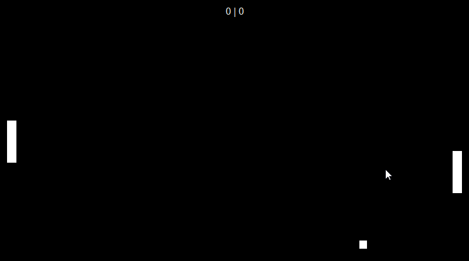

# WinForms Pong
> A simple pong game based off the 1972 ATARI pong game for the arcade.

WinForms Pong is a simple project of mine done as to increase my understanding not only of winforms but also of C# in general. Although I have previously worked in more complex projects, I feel like it is polished enough as to make it my first public repository.

## Usage example

WinForms Pong can be used as a fun little game for two players or also as project to learn from for those just starting with C# or programming in general.

## Release History

* 0.2.1
    * ADD: Prompt to restart the game
* 0.2.0
    * ADD: Control customization
    * ADD: Win score customization
    * ADD: Win condition added
    * ADD: Settings menu
* 0.1.0
    * Release
* 0.0.1
    * Work in progress

<!-- Markdown link & img dfn's -->
[npm-image]: https://img.shields.io/npm/v/datadog-metrics.svg?style=flat-square
[npm-url]: https://npmjs.org/package/datadog-metrics
[npm-downloads]: https://img.shields.io/npm/dm/datadog-metrics.svg?style=flat-square
[travis-image]: https://img.shields.io/travis/dbader/node-datadog-metrics/master.svg?style=flat-square
[travis-url]: https://travis-ci.org/dbader/node-datadog-metrics
[wiki]: https://github.com/yourname/yourproject/wiki
